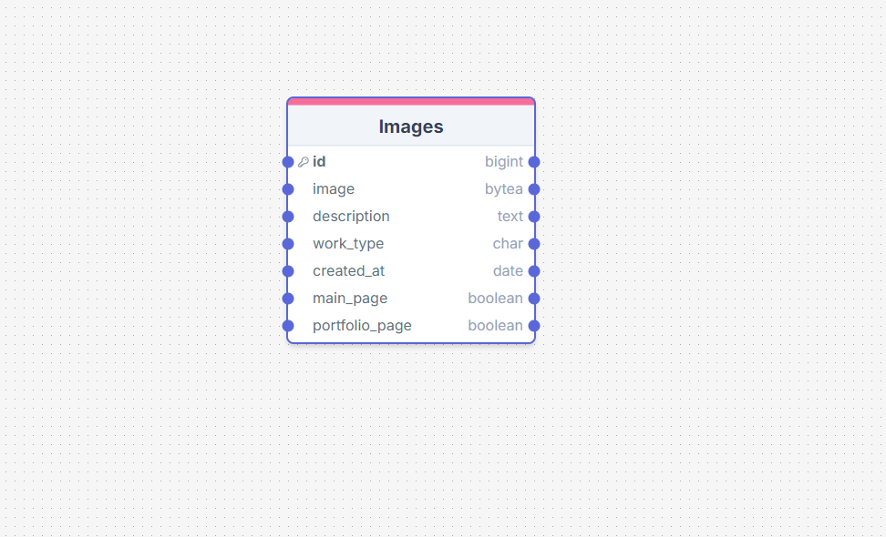

# TC Carpentry

## Overview

TC Carpentry is a website designed for a local buissness, who provide a service on all aspects of carpentry. This site is to allow users to understand more about TC Carpentry, see the work they have done and be able to contact them regarding any work they would like done.

## Content

- [TC Carpentry](#tc-carpentry)
  - [Overview](#overview)
  - [Backend](#backend)
    - [Planning](#planning)
    - [Data Models](#data-models)
    - [API Endpoints](#api-endpoints)
    - [Technologies Used](#technologies-used)
      - [Languages Used](#languages-used)
      - [Frameworks and Tools Used](#frameworks-and-tools-used)
      - [Libraries Used](#libraries-used)
    - [Testing](#testing)
    - [Deployment](#deployment)
  - [Frontend](#frontend)

## Planning

Planning started by using agile methodologies by delivering small features across the duration of the project. This broke down the build of the project into a lot more manageable parts and was able to select which user stories were more important to the site. The user stories were then used to help create wireframes to see how the user would navigate and use the app. This can all be seen in more details in the frontend section [here](#frontend).
These were then used to help work out the required API endpoints to support the desired functionality of the site.

## Data Models

Data model schema was planned with the API endpoints, using an entity relationship diagram to show how the models were related.

The custom models TC Carpentry are:

***Images***

The Images model was created so for the images of the site. The admin is able to then take control of what images are displayed and updated by their own choice.

An entity relationship diagram was created using drawSQL to show the schemas for each of the models and how they are related:

[back to top](#tc-carpentry)

## API Endpoints

| URL | HTTP Method | CRUD Operation | View name |
| --- | --- | --- | --- |
| `Image Endpoints` |
| /api/images | GET | List all profiles | LIST |
| `Email Endpoints` |
| /api/send-email/ | Ability for user to post email | POST |

[back to top](#tc-carpentry)

    