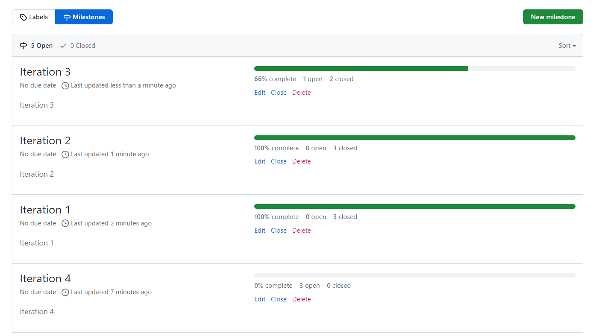
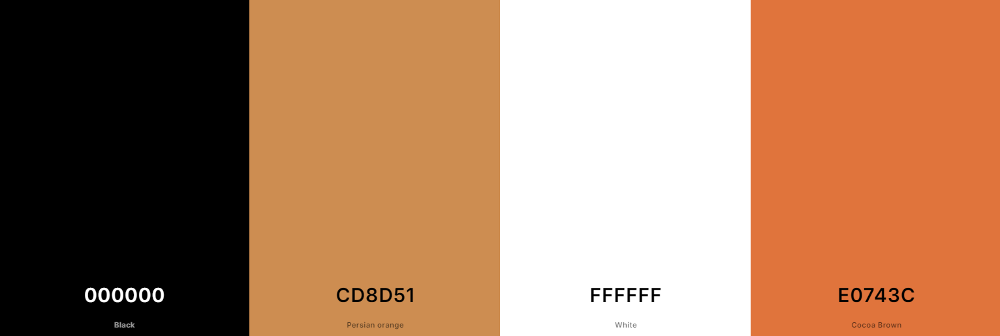

# TC Carpentry

## Overview

TC Carpentry is a website designed for a local buissness, who provide a service on all aspects of carpentry. This site is to allow users to understand more about TC Carpentry, see the work they have done and be able to contact them regarding any work they would like done.

Here is a live version of my project [Strongest Avenger](https://tc-carpentry-d2974ed67d90.herokuapp.com/)

djf live version of responsive screenshot here kjsdfnbs

## Content

- [TC Carpentry](#tc-carpentry)
  - [Overview](#overview)
  - [Backend](#backend)
    - [Planning](#planning)
    - [Data Models](#data-models)
    - [API Endpoints](#api-endpoints)
    - [Technologies Used](#technologies-used)
      - [Languages Used](#languages-used)
      - [Frameworks and Tools Used](#frameworks-and-tools-used)
      - [Libraries Used](#libraries-used)
    - [Testing](#testing)
    - [Deployment](#deployment)
  - [Frontend](#frontend)
    - [User Experience](#user-experience)
      - [The strategy Plane](#the-strategy-plane)
        - [Ideal User](#ideal-user)
        - [Site Goals](#site-goals)
      - [Agile Planning](#agile-planning)
        - [User Stories](#user-stories)
      - [Skeleton Plane](#skeleton-plane)
        - [Wireframes](#wireframes)
        - [Database Schema](#database-schema)
        - [Security](#security)
      - [The Scope Plane](#the-scope-plane)
      - [The Structure Plane](#the-structure-plane)
        - [Features](#features)
      - [The Surface Plane](#the-surface-plane)
        - [Design](#design)
    - [Use of Components](#use-of-components)
    - [Custom Hooks](#custom-hooks)
    - [Technologies Used](#technologies-used)
      - [Languages Used](#languages-used)
    - [Frameworks, Libraries and Dependencies](#frameworks-libraries-and-dependencies)
      - [React](#react)
      - [React-Router-DOM](#react-router-dom)
      - [ReactDOM](#reactdom)
      - [Axios](#axios)
      - [React Bootstrap](#react-bootstrap)
      - [Font Awesome](#fontawesome)
      - [Google Fonts](#google-fonts)
      - [Prettier](#prettier)
    - [Testing](#testing)
  - [Credits](#credits)

    

## Planning

Planning started by using agile methodologies by delivering small features across the duration of the project. This broke down the build of the project into a lot more manageable parts and was able to select which user stories were more important to the site. The user stories were then used to help create wireframes to see how the user would navigate and use the app. This can all be seen in more details in the frontend section [here](#frontend).
These were then used to help work out the required API endpoints to support the desired functionality of the site.

## Data Models

Data model schema was planned with the API endpoints, using an entity relationship diagram to show how the models were related.

The custom models TC Carpentry are:

***Images***

The Images model was created so for the images of the site. The admin is able to then take control of what images are displayed and updated by their own choice.

An entity relationship diagram was created using drawSQL to show the schemas for each of the models and how they are related:

[back to top](#tc-carpentry)

## API Endpoints

| URL | HTTP Method | CRUD Operation | View name |
| --- | --- | --- | --- |
| `Image Endpoints` |
| /api/images | GET | List all profiles | LIST |
| `Email Endpoints` |
| /api/send-email/ | Ability for user to post email | POST |

[back to top](#tc-carpentry)

## Technologies Used

### Languages Used

- Python

### Frameworks and Tools Used

- Django Rest Framework
  - Django Rest Framework was used as the main python framework in the development of this project.
- Aiven
  - Aiven was used for the production database.
- Cloudinary
  - Cloudinary was used to store the images and videos posted.
- VS Code
  - VS Code was used to write the code.
- GitHub
  - GitHub was used to store the projects code after being pushed from Gitpod.
- Heroku
  - Heroku was used for deployment.
- DrawSQL
  - DrawSQL was used to draw out the entity relationship diagram.

### Libraries Used

- Django - A python package for the django rest framework.
- psychopg2 - Database adapter to enable interaction between Python and PostgreSQL database.
- django cors headers - This Django app adds CORS headers to responses, to enable the API to respond to requests from origins other than its own host.
- Cloudinary - Used to store images and videos.
- Pillow - Used for image processing.
- gunicorn - Used to help run application.
- django filter - Used to help filter requests from frontend for images.

[back to top](#tc-carpentry)

## Testing

I have included details of my testing during and post development in a separate file called [TESTING_BACKEND.md](TESTING_BACKEND.md).

## Deployment

***GitHub***

This project was developed by using a Visual Studio Code. I first created a project in my folders and opened in VS Code.

- Once loaded, I then created a new repository for the project in GitHub.
- In GitHub, on the topleft there is a button labelled "new". Click this.
- Once clicked, I picked my repository name, then clicked the button labelled "Create repository".
- After this you can see the URL you need to set up your workspace to this GitHub repository.
- To then initially set up your workspace to the repository you first need add the repository with the command 'git remote add origin https://github.com/YOUR-USERNAME/YOUR-REPOSITORY.git'.
- Next add the changes with the command 'git add .'.
- Next commit the changes with the command 'git commit -m "initial commit"'.
' Next push to GitHub with the command 'git push -u origin main'. Once this push has been made, you then only have to use the command 'git push'.

***Version Control***

For version control the following steps were made:

- If any changes were made to my VS Code project.
- First files were made ready for commit with command - git add filename or git add . to add all files.
- To commit the changes using the following command - git commit -m "This is my commit" Note the brief description at the end of the command to make you aware of what changes have occurred.
- To then move the changes to GitHub, use the following command - git push

***Clone Repo***

Creating a clone allows you to make a copy of the repository at the specific point in time. This lets you run a copy of the project locally. This can be done by:

- Navigate to the repository you choose to clone in your GitHub.
- Clicking on the arrow of the green button named "Code" at the top of the file.
- Then select "Local" then under local select "HTTPS" and then copy that URL.
- Navigate to your code editor and within the terminal change the directory to the location you wish to clone the repository to.
- Type "git clone" and paste the copied HTTPS link from GitHub.
- Press enter and git will clone the repository to your local machine.

***Forking the GitHub Repository***

Forking the GitHub repository allows you to make a copy of the original repository on your GitHub account to view and make changes without it effecting the original repository. This can be done by:

- Log in to your GitHub account and locate the repository you wish to fork.
- Near the top of the page, under the "settings" button going across the page, you should see a button saying "Fork".
- Click the "Fork" button and you should now have a copy of the original repository in your GitHub account.

[back to top](#tc-carpentry)

***Deployment to Heroku***

For deployment to Heroku the following steps were made:

- First sign in to your Heroku account.
  - On the top right of the page there is a drop-down menu called "new", click this and click on "create new app".
  - You then need to decide your unique app name using '-' between each word. Then select which region you are working from and then click on the button "create app".
  - Once you have clicked on "create app" you will be taken to a new page. On this page you will see a row of tabs at the top left of the page. You first need to click on the "settings" tab and go to the settings page.
  - Login into your Aiven account and create a new project.
  - Check the options you selected the click create project.
  - Once Aiven project is created, click on the project created and there you will see the URL, which you can copy ready to be placed in the Heroku app.
  - You will also need to log into your Cloudinary account, there you can select the dashboard option. In there you will see your Cloudinary URL, you will also need this for the Heroku app. You can copy this by clicking on the eye symbol next to it.
  - If you have any code that you have kept private which has been prevented from loading to your GitHub, then you must click on the button "Reveal Config Vars". A small table will then appear with columns "key" and "value". Config Vars used:
    - CLOUDINARY_URL: (Enter Cloudinary API URL)
    - DATABASE URL: (Enter the database URL from AIVEN)
    - SECRET_KEY: (Enter your secret key)
    - ALLOWED_HOST: (Enter the deployed Heroku app URL)
    - Also need to add the required envirmoent variables needed to send emails from the contact form.
  - I then went back to the tabs row at the top of the page and clicked on the "Deploy" tab to take me to the deploy page.
  - On the deployment page, I scrolled down to deployment method and confirmed I wanted to deploy through GitHub.
  - When I click on GitHub a search bar will appear underneath which will allow me to search for my GitHub repository. I made sure I spelt the repository I'm searching for exactly as I named it and then clicked the search button.
  - The repository then appeared underneath my search, I checked this was the correct repository and then clicked the "connect" button. This has now linked up my Heroku app and my GitHub repository code.
  - I then scrolled down to the button "Enable Automatic Deploys", this allows my Heroku app to automatically update every time I've pushed a new change to my code to GitHub. This is optional.
  - I then scrolled down and clicked on the button "Deploy Branch" which is now building the app.
  - Once the app is successfully deployed, a message appeared saying "your app was successfully deployed." Then click on the "view" button which will take me to the deployed link.

  [back to top](#tc-carpentry)

  ## Frontend

  ### User Experience

  #### The Stratgey Plane

  TC Carpentry is intended for people who would like any aspect of carpentry work done. Here they can see a very professional and friendly company, and what they are about. They are able to see all aspects of work they cover, images of their previous work and ways of which to contact them.

  ##### The Ideal User

- Someone who needs carpentry work done
- Someone who likes to see the companies previous work before making a decision.
- Someone who doesn't know a carpenter and can easily contact this one.

##### Site Goals

- To provide the user with the ability to find out more about TC Carpentry.
- To provide the user with images and information about what work TC Carpentry does.
- To provide users with ways in which to contact TC Carpentry.

[back to top](#tc-carpentry)

### Agile Planning

This project was developed using agile methodologies by delivering small features across the duration of the project. This broke down the build of the project into a lot more manageable parts and was able to select which user stories were more important for the site.

It was carried out this way to try ensuring that all core requirements were completed first to give the project a complete feel and to make sure the most important user stories were implemented. When clicked on and opened the user story, the user story was assigned a label "must have", "should have" or "could have" so I would know the importance of the user story.

The kanban board was created using GitHub projects, this helped me be able to see all my user stories and be able to keep track of which ones had been done, to do or in progress.

Each User story was placed into it's own milestone iteration to help schedule the development of the project. These iterations can be set with dates but I did not do this due to fitting in around work and other commitments. In the iteration you can close a user story when finished, this will also keep track of how much is completed.

Milestones:

[back to top](#tc-carpentry)

##### User Stories

***Themes***

Themes were developed using the project goals as a starting point. These included:

  - User management - This was necessary so that user could have all the necessary functions across the site.

  - Admin management - This was necessary so that the admin to have full function of admin data and images on site.

***Epics***

Themes were then refined into the following epics:

- User management:
  
  - Easily navigate across site.

  - Able to contact TC Carpentry.

- Admin management:

  - Sign in to admin page.

  - Add images.

  - Delete images.

***User Stories***

The following user stories were completed throughout the development:

Homepage:

  - As a User I can view homepage so that I can see all about TC Carpentry and images.

Navabr Navigation:

  - As a User I can navigate the site using the navbar so that easily navigate across the site.

Footer:

  - As a User I can see the footer and able to click on the links so that I can see information about TC Carpentry and follow them on other platforms.

Services Page:

  - As a User I can access the services page so that I can read and see about all the services TC Carpentry offers.

Portfolio Page:

  - As a User I can access the portfolio page so that I can view all the images of all their previous work.

Admin Add Images to Portfolio Page:

  - As a Admin I can add images to the portfolio page so that I can control what images are displayed in the portfolio page, what section and update.

Admin Delete Images:

  - As a Admin I can delete images so that I can control what images are being displayed, what pages and update.

Admin Add Images to Main Page:

  - As a Admin I can add images to the main page so that I can display what images I like for the main page slideshow.

Admin Sign In:

  - As a Admin I can sign in to the admin page so that I can see the admin data.

About Page:

  - As a User I can access the about page so that I can read all about TC Carpentry, their experience and what they do.

Contact Page:

  - As a User I can access the contact page so that I am able to get in contact with TC Carpentry.

Contact Form:

  - As a User I can Fill out and send the contact form so that I can directly and easily contact TC Carpentry with my enquiries.

[back to top](#tc-carpentry)

#### The Skeleton Plane

##### Wireframes

Wireframes were used to create a prototype of the project which may change during its development.

wireframes screenshots to go here jsdb

[back to top](#tc-carpentry)

##### Database Schema

This is well explained in the backend repository readme [here](#backend)

##### Security

For security Ive made sure that csrf tokens are used for submitting forms. These are created in the backend and connected to the frontend.

Admin is also protected my username and password from Django's built in admin user.

#### The Scope Plane

- Responsive Design - The site should be fully functional on all devices from 320px wide and up.

- Hamburger menu for navbar on mobile devices.

- Homepage welcoming user to the site and links to navigate through the site and ability to conatct TC Carpentry.

[back to top](#tc-carpentry)

#### The Structure Plane

##### Features

As a User I would like to view the site on all my different devices so I can view site wherever I am.

#### The Surface Plane

##### Design

***Colour Scheme***

I opted for a very few choices of colours throughout the site. The same colours have been implemented across the site and are included in the button's styles.

This hopefully makes the site easy and clear to read / use.

The colour palette was created using the coolors website.

***Imagery***

The logo for the site was taken from google.

Font awesome was used to for the sites icons.

Google fonts was used for the font style.

[Back to top](#tc-carpentry)

### Use of Components

A number of reusable React components were created with the intention of reducing code duplication.

***AlertMessage.js***

Used to show alert messages to inform user of different actions. This was passed as a prop so each alert when called can display it's own message. 

***AlertMessageNoImageAlert***

Used to show an alert message when app has gone to retrieve images from the backend but there is no images for this purpose.

***ContactForm***

Used so that the contact form can be displayed on numerous pages.

***ContactFormErrorAlert***

Used to display errors for each field for the contact form.

***ContactFormFields***

Used to create individual fields for the contact form.

***CustomButton***

Used to create a custom button and then styled depending on what purpose the button is used for, which is passed as a prop.

***FetchImagesErrorAlert***

Used to show an alert message when trying to fetch images from the backend but an error has occured.

***Footer***

Used to display the footer on all pages.

***LoadingSpinner***

Used to display loading spinner for whenever site is loading. Spinner can be different sizes depending on purpose, which is passed as a prop.

***NavBar***

Used to display navbar on all pages.

***NavBarNavLink***

Used to create numerous nav links for the navbar, which diferent information was passed as props.

***NotFoundPage***

Used to be displayed when ever trying to access a page that doesn't exist.

[Back to top](#tc-carpentry)

### Custom Hooks

***useClickOutsideToggle.js***

This custom hook is used so that in mobile devices, if the navbar dropdown menu has been toggled open, the user can click anywhere outside the dropdown menu and this will still toggle the dropdown menu closed.

***useCsrfToken***

This custom hook is used to fetch the csrf tokens from the backend.

***useFetchImages***

This custom hook is used to fetch the images from the backend and called depending on what page the user is on. What page the user is on is passed as a prop so the hook knows what filter to use to fetch the correct images. Hook also lets know when its loading and if there are any errors.

[Back to top](#tc-carpentry)

### Languages Used

- HTML5

- JSX

- CSS

- JavaScript

[Back to top](#tc-carpentry)

### Frameworks, Libraries and Dependencies

#### React

React is the frontend framework used to create the frontend of this project.

#### React-Router-Dom

React-Router-Dom is used to enable client side routing for React web applications and is used to implement basic routing across this project.

#### ReactDOM

ReactDOM is used for rendering components to the DOM. It bridges the gap between Reacts Virtual DOM and the actual DOM in the browser.

#### Axios

Axios was used to simplify requests made to the REST API.

#### React Bootstrap

React Bootstrap was used to help with the styling and layout of the entire project.

#### Font Awesome

Font awesome was used for the icons used across the site.

#### Google fonts

Google fonts was used to provide the font for the site.

#### Prettier

Prettier is used as code formatting tool which helped me structure my code in the correct way.

[Back to top](#strongest-avenger-react)

### Testing

I have included details of my testing during and post development in a separate file called [TESTING_FRONTEND.md](TESTING_FRONTEND.md)

[Back to top](#strongest-avenger-react)

### Credits

- Code Institute - Without the knowledge gained through out doing the course I would not have been able to build this project.

- React Framework - React Framework - For being able to use React Framework to build my project and all the documentation to help build and set up correctly.

- Cloudinary - For storing the data for my posts.

- StackOverflow - For helping give me with ideas on how to overcome issues I encountered.

- Google Fonts - For supplying the fonts used.

- Font Awesome-  For Providing the icons used throughout this project.

[Back to top](#strongest-avenger-react)

